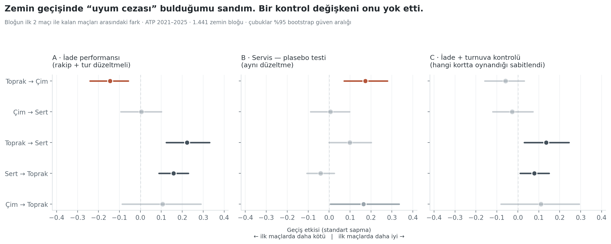
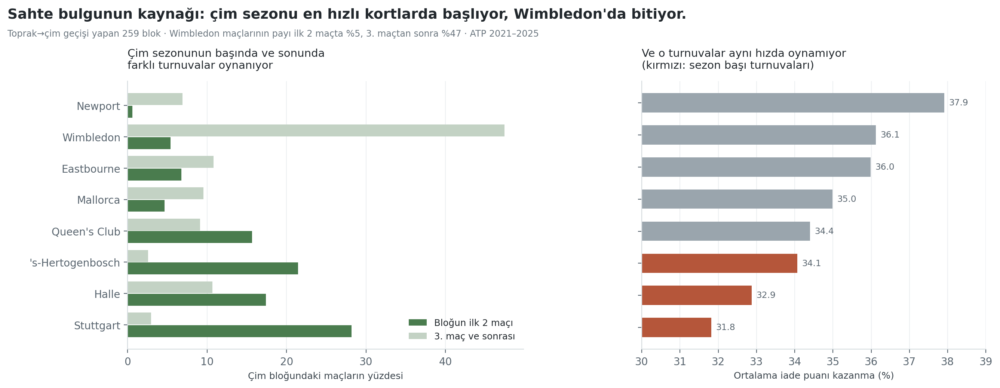
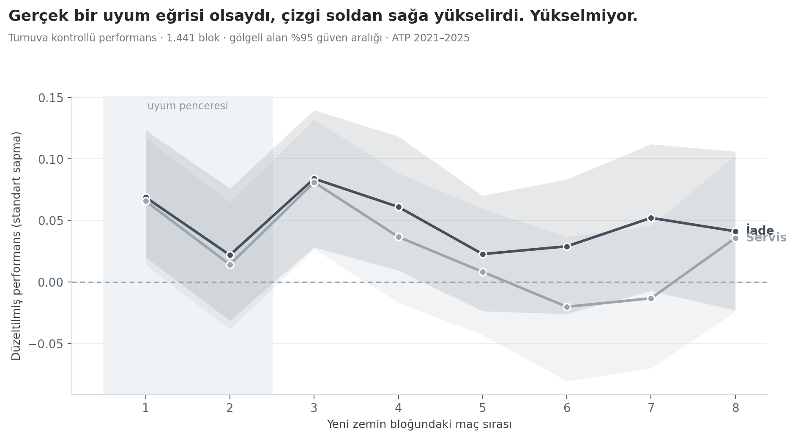

# Zemin Geçiş Hızı Analizi

**Tenisçilerin zemin adaptasyonunu ölçmeye çalıştım. Bulduğum etki, bir kontrol değişkeni ekleyince kayboldu.**



Toprak sezonundan çim sezonuna geçen bir oyuncu, Wimbledon'daki ilk maçlarında normalinden kötü mü iade ediyor? İlk analiz "evet" dedi (−0.14 SD, p = 0.002). Turnuva kimliğini modele ekledikten sonra etki üçte birine indi ve anlamlılığını kaybetti (−0.06 SD, p = 0.24).

Sebep basit ama görülmesi kolay değil: **çim sezonu Stuttgart ve Halle'de başlar, Wimbledon'da biter.** Bunlar farklı hızda kortlar. "Oyuncu henüz adapte olamamış" sandığımız şey, büyük ölçüde "ilk maçlar daha hızlı kortlarda oynanmış" demekti.

---

## Soru

Zemin geçişlerinde ölçülebilir bir **uyum süresi** var mı? Varsa oyuncudan oyuncuya değişiyor mu?

Bu, yaygın "zemin adaptasyon indeksi" yaklaşımlarından farklı bir soru. Onlar oyuncunun üç zemindeki ortalama performansının değişkenliğine bakar — bu bir *seviye* ölçüsüdür, *uyum* ölçüsü değil. Burada adaptasyonu zamansal olarak tanımlıyorum: yeni zemine geçtikten sonraki ilk maçlar ile aynı sezonun geri kalanı arasındaki fark.

| Hipotez | İçerik | Sonuç |
|---|---|---|
| **H1** | Yeni zeminin ilk maçlarında performans düşer | **Reddedildi** — tersi yönde, zayıf bir etki var |
| **H2** | Etkinin büyüklüğü geçişin yönüne bağlıdır | Kısmen — ama zemine özgü değil |
| **H3** | Uyum hızı kalıcı bir oyuncu özelliğidir | **Reddedildi** — r = 0.07, sıfırdan ayırt edilemez |

---

## Veri

**Kaynak:** [Tennismylife/TML-Database](https://github.com/Tennismylife/TML-Database) · CC BY-NC-SA
**Köken:** Jeff Sackmann / [Tennis Abstract](https://github.com/JeffSackmann)
**Dönem:** 2021–2025 (5 tam sezon) · **Çekim tarihi:** 31 Temmuz 2026

> Proje başlangıçta Jeff Sackmann'ın `tennis_atp` reposunu kullanacaktı. Çalışma sırasında repo erişilemez hale geldi (404). Aynı şemayı kullanan TML-Database aynasına geçildi; sütun yapısı birebir aynı olduğu için kodda değişiklik gerekmedi. TML-Database ayrıca `indoor` sütunu içeriyor ve bu, kapalı kort ayrımını bir robustluk kontrolü olarak yapmayı mümkün kıldı.

### Temizlik

| Filtre | Atılan satır | Oran |
|---|---:|---:|
| Takım/gösteri turnuvaları + Davis Cup + Olimpiyat | 1.547 | %10,5 |
| Zemin bilgisi eksik | 0 | %0,0 |
| Yarıda kalan maç (RET / W-O / DEF) | 475 | %3,2 |
| Servis istatistiği eksik | 6 | %0,0 |
| Anormal kısa maç (< 20 servis puanı) | 1 | %0,0 |
| **Kalan** | **12.639** | **%86,2** |

Takım ve gösteri etkinlikleri (United Cup, ATP Cup, Laver Cup, Davis Cup, Olimpiyat) bilinçli olarak çıkarıldı: takvimin ortasına serpiştirilmiş tek maçlık adacıklar üretip blok algoritmasını bozuyorlar.

---

## Yöntem

### 1. Uzun format

Her maç iki satıra çevrilir — her oyuncunun kendi perspektifi. 12.639 maç → **25.278 satır**.

Ana metrik **iade puanı kazanma oranı (RPW)**: rakibin servis attığı puanların kaçını kazandım.

```
RPW = (rakip_svpt − rakip_1stWon − rakip_2ndWon) / rakip_svpt
```

Doğrulama olarak `RPW + SPW = 1.0000` kontrolü her çalıştırmada koşuyor — her iade puanı, birinin kaybettiği servis puanıdır.

| Zemin | Ortalama RPW | SD | Maç |
|---|---:|---:|---:|
| Toprak | 0,3804 | 0,0853 | 7.786 |
| Sert | 0,3545 | 0,0858 | 14.456 |
| Çim | 0,3387 | 0,0796 | 3.036 |

### 2. Rezidüalizasyon

Ham iade yüzdesi üç şeyden etkilenir: oyuncunun becerisi, **rakibin servis gücü** ve bağlam. Bunları ayırmak için toplamsal bir ridge modeli kurulur:

```
RPW ~ oyuncu + rakip + zemin + tur  (+ turnuva)
```

Rezidü = gözlenen − tahmin. Sonra zemin bazında standartlaştırılır.

**Bu adım opsiyonel bir iyileştirme değil, geçerliliğin ön koşulu.** Bir bloğun ilk maçları neredeyse her zaman erken turlardır, yani zayıf rakiplere karşı. Ham veride iade yüzdesi R128'de %36,4 iken finalde %34,9'a düşüyor. Düzeltmeden sonra bu eğim tamamen kayboluyor (tüm turlarda ≈ 0,00).

Model R² = 0,297 (turnuva eklenince 0,327). Yani tek maçtaki iade yüzdesinin yalnızca %30'u yapısal, kalanı maçtan maça dalgalanma. Bu, H3'ün neden test edilebilir olmadığını önceden haber veriyor.

### 3. Zemin bloğu

Her oyuncunun maçları kronolojik dizilir. **Ardışık aynı zemindeki maçlar bir blok oluşturur.** Zemin değişince veya 60 günden uzun ara verilince yeni blok başlar.

Geçerlilik: blok ≥ 5 maç, öncesinde farklı zeminli bir blok olmalı. Sonuç: **1.441 blok · 16.008 maç · 232 oyuncu.**

Algoritma tenis takvimini kendiliğinden yeniden üretiyor. Alcaraz'ın 2024 sezonu:

```
Hard  |  4 maç | Australian Open
Clay  |  3 maç | Buenos Aires
Hard  | 10 maç | Indian Wells, Miami
Clay  | 11 maç | Madrid, Roland Garros
Grass |  9 maç | Queen's Club, Wimbledon
Hard  | 17 maç | Cincinnati, US Open, Beijing, Shanghai
```

### 4. Geçiş cezası (TP)

```
TP = ortalama(bloğun ilk 2 maçı) − ortalama(kalan maçlar)
```

Negatif = geçişte bozulma. Blok içinde karşılaştırma yaptığımız için oyuncunun o zemindeki genel beceri düzeyi yapısal olarak sadeleşir — "iyi oyuncu / kötü oyuncu" karışması bu tasarımda mümkün değil.

### 5. Modelleme

`statsmodels` MixedLM denendi; oyuncu varyansı parametre uzayının sınırında (sıfırda) tahmin edildiği için Hessian tekilleşti ve standart hatalar patladı (SH ≈ 3,4 milyon). Varyansın sıfır çıkması, kendi başına H3'ün cevabı.

Bu yüzden **blok düzeyinde OLS + oyuncu bazında kümelenmiş standart hata** kullanıldı — aynı bağımlılığı hesaba katar, sayısal olarak kararlıdır.

---

## Bulgular

### H1 — Uyum cezası yok, zayıf bir "taze başlangıç" etkisi var

| Model | Katsayı | SH | p |
|---|---:|---:|---:|
| İade | +0,0806 | 0,0216 | 0,0002 |
| İade + turnuva kontrolü | +0,0441 | 0,0219 | 0,0447 |
| Servis (plasebo) | +0,0449 | 0,0221 | 0,0420 |
| **Servis + turnuva kontrolü** | **+0,0837** | 0,0213 | **0,0001** |

Katsayılar **pozitif**: oyuncular yeni zeminin ilk maçlarında ortalamalarının biraz *üstünde* oynuyor. Hipotezin tersi.

Son satır kritik. Turnuva kontrolünden sonra kalan etki **serviste iadeden neredeyse iki kat büyük** (+0,084 vs +0,044). Zemin uyumu ölçüyor olsaydık bunun tersini görmemiz gerekirdi — servis zemin değişiminden çok daha az etkilenir. İkisi de aynı yönde ve serviste daha güçlüyse, ölçtüğümüz şey zemine özgü değil: dinlenme sonrası genel tazelik.

**Pratik büyüklük:** 0,10 SD ≈ 0,85 yüzde puanı ≈ maç başına 0,7 iade puanı. Kalan +0,044'lük etki maç başına yaklaşık **üçte bir puan** eder. İstatistiksel olarak sıfırdan farklı, pratik olarak ihmal edilebilir.

### H2 — Toprak→çim bulgusu bir turnuva kompozisyonu yanılsaması



| Geçiş | Temel model | + turnuva kontrolü | p |
|---|---:|---:|---:|
| Toprak → Çim | −0,1443 | −0,0586 | 0,236 |
| Toprak → Sert | +0,2227 | +0,1349 | 0,006 * |
| Sert → Toprak | +0,1579 | +0,0787 | 0,027 * |
| Çim → Sert | +0,0045 | −0,0275 | 0,616 |
| Çim → Toprak | +0,1065 | +0,1098 | 0,196 |

Mekanizma doğrudan veride görünüyor:

| Turnuva | Bloğun ilk 2 maçındaki payı | 3. maç ve sonrası | Ortalama iade % |
|---|---:|---:|---:|
| Stuttgart | %28,2 | %2,9 | 31,8 |
| Halle | %17,4 | %10,7 | 32,9 |
| 's-Hertogenbosch | %21,4 | %2,6 | 34,1 |
| Queen's Club | %15,6 | %9,1 | 34,4 |
| **Wimbledon** | **%5,4** | **%47,4** | **36,1** |

Çim sezonunun ilk maçları turun en hızlı, iadesi en zor kortlarında oynanıyor; sonraki maçların yarısı Wimbledon'da. Aradaki 4,3 puanlık kort farkı, "adaptasyon cezası" diye okuduğumuz şeyin kaynağı.

Hayatta kalan iki geçiş (toprak→sert, sert→toprak) de pozitif ve ikisi de sezon başlangıçlarına denk geliyor — yine tazelik.

### H3 — Adaptasyon hızı diye kalıcı bir oyuncu özelliği yok

| Ölçüm | n | r | p |
|---|---:|---:|---:|
| İade | 53 oyuncu | +0,021 | 0,882 |
| İade + turnuva | 53 oyuncu | +0,069 | 0,622 |
| Servis | 53 oyuncu | +0,113 | 0,422 |

Bir oyuncunun 2021–23'teki geçiş cezası, 2023–25'teki geçiş cezasını **hiç öngörmüyor**. Test-tekrar test güvenilirliği sıfır.

Bu, "en hızlı adapte olan 10 oyuncu" listelerinin ölçtüğü şeyin gürültü olduğu anlamına geliyor. Böyle bir sıralama yapılabilir, güzel de görünür — ama ertesi yıl tamamen değişir.



---

## Robustluk

Her satır tüm hattı baştan koşar.

| Varyant | Blok | Genel | p | Toprak→Çim | p |
|---|---:|---:|---:|---:|---:|
| **Temel (K=2, min=5, 60 gün)** | 1.441 | +0,048 | 0,031 | −0,059 | 0,236 |
| Uyum penceresi K=1 | 1.441 | +0,064 | 0,030 | −0,013 | 0,843 |
| Uyum penceresi K=3 | 1.441 | +0,090 | 0,000 | +0,041 | 0,373 |
| Min blok boyu = 4 | 1.676 | +0,076 | 0,001 | +0,009 | 0,855 |
| Min blok boyu = 6 | 1.218 | +0,029 | 0,202 | −0,074 | 0,185 |
| Min blok boyu = 8 | 894 | +0,002 | 0,953 | −0,128 | 0,099 |
| Boşluk eşiği 45 gün | 1.409 | +0,040 | 0,076 | −0,059 | 0,236 |
| Boşluk eşiği 90 gün | 1.465 | +0,049 | 0,026 | −0,059 | 0,236 |
| Ridge alpha = 1 | 1.441 | +0,048 | 0,031 | −0,058 | 0,237 |
| Ridge alpha = 20 | 1.441 | +0,048 | 0,028 | −0,059 | 0,231 |
| Sadece Slam + Masters | 638 | +0,046 | 0,186 | +0,126 | 0,113 |
| Indoor ayrı zemin sayılır | 1.942 | +0,077 | 0,000 | −0,059 | 0,236 |
| Servis (plasebo) | 1.441 | +0,085 | 0,000 | +0,088 | 0,136 |

**Toprak→çim etkisi 13 varyantın hiçbirinde anlamlı değil** (p aralığı 0,099–0,855; bazı varyantlarda işaret bile ters dönüyor).

**Kalan genel etki kırılgan.** Minimum blok boyu 4'ten 8'e çıkarıldığında katsayı +0,076'dan +0,002'ye düşüyor. Yani "taze başlangıç bonusu" ağırlıklı olarak kısa bloklardan geliyor — 5 maçlık bir blokta ilk 2 maç bloğun %40'ı ve karşılaştırma penceresi yalnızca 3 maç. Bu, aşağıdaki hayatta kalma yanlılığının doğrudan izi.

Ridge regülarizasyon parametresi sonucu hiç etkilemiyor.

---

## Sınırlılıklar

1. **Hayatta kalma yanlılığı.** Bir bloğun "baz" penceresi ancak oyuncu maç kazanıp devam ederse oluşur. Erken elenenler örneklemden düşer. Robustluk tablosu bu yanlılığın etkisini görünür kılıyor ama ortadan kaldırmıyor.

2. **Turnuva kontrolü fazla düzeltiyor olabilir.** Eğer gerçek adaptasyon süreci sistematik olarak belirli turnuvalara denk geliyorsa, turnuva sabit etkisi onu da emer. Bu analiz "turnuva kimliği sabitken adaptasyon var mı" sorusunu yanıtlıyor; daha zayıf ama daha savunulabilir bir soru.

3. **İade yüzdesi adaptasyonun tek boyutu.** Hareket, taktik seçimi, kayma tekniği bu veride yok.

4. **Örneklem.** Yalnızca üst düzey ATP (250 ve üzeri), 5 sezon, 232 oyuncu, 1.441 blok. Toprak→çim geçişi 259 blok; sert→çim yalnızca 10 blok olduğu için analiz dışı.

5. **Ölçüm gürültüsü.** Tek maçlık iade yüzdesinin yalnızca %30'u yapısal. Küçük bireysel farkları tespit etmek için istatistiksel güç düşük. H3'ün "hayır" cevabı, "fark yok"tan çok "bu veriyle ayırt edilemez" olarak okunmalı.

6. **60 günlük blok ayırma eşiği** teorik değil pratik bir seçim; 45 ve 90 gün varyantları test edildi, sonuç değişmedi.

---

## Tekrar üretim

```bash
git clone <repo>
cd zemin-gecis-analizi
pip install -r requirements.txt

python app.py      # veri hattı + modeller  (~5 dk, ilk çalıştırmada indirir)
python viz.py      # grafikler → figures/
```

`app.py` içindeki `ROBUSTLUK_KOS = False` yapılırsa Bölüm 10 atlanır ve süre ~1 dakikaya iner.

Veri dosyaları `.gitignore` içinde — `app.py` ilk çalıştırmada kaynaktan indirir.

```
app.py       Bölüm 1-7, 9, 10 — veri hattı, testler, robustluk
viz.py       Bölüm 8 — üç grafik
data/        ara çıktılar (parquet)
figures/     PNG çıktılar
```

---

## Atıf ve lisans

Veri: [Tennismylife/TML-Database](https://github.com/Tennismylife/TML-Database), CC BY-NC-SA.
Köken: Jeff Sackmann, [Tennis Abstract](https://github.com/JeffSackmann) — veri seti kişisel emekle sürdürülüyor, ticari kullanım lisans şartlarına aykırıdır.

Kod MIT lisanslıdır. Veri dosyaları bu repoda yeniden dağıtılmaz.
